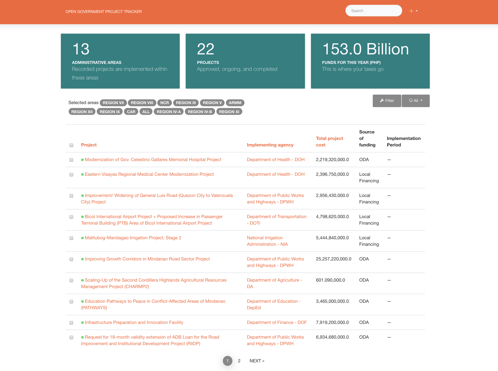

Open Government Project Tracker
---

CMSC 208 Software Engineering Project




# Development

## Requirements

The `requirements.txt` file is generated from the command
`pipenv run pip freeze > requirements.txt`. **Do not manually edit `requirements.txt`.**

Software packages:
- SQLite
- PostgreSQL
- MySQL

Common setup:

```sh
# Installation
git clone git@github.com:aldnav/ogpt.git
cd ogpt
pipenv install
pipenv shell  # virtualenv activated

ENV=dev ./manage.py migrate
ENV=dev ./manage.py collectstatic -l
ENV=dev ./manage.py masterdata

# Running the local server
ENV=dev ./manage.py runserver 0.0.0.0:8000
```

# Contributors

- Aldrin Navarro <aldrinnavarro16@gmail.com>
- Raphael Elamparo <lrcelamparo@gmail.com>
-
-

