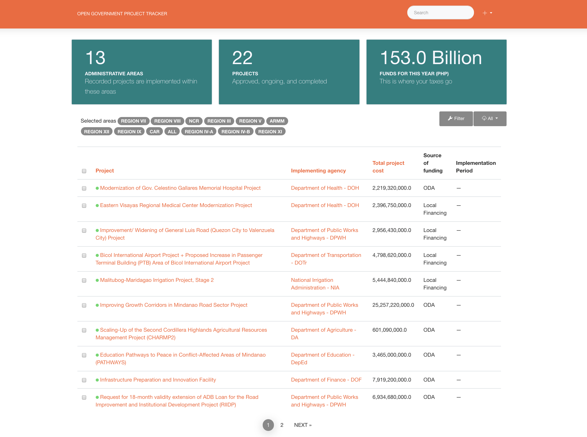

# Open Government Project Tracker

CMSC 208 Software Engineering Project



## Development

Read more at [docs/development.md](docs/development.md).

Common setup:

```sh
# Installation
git clone git@github.com:aldnav/ogpt.git
cd ogpt
uv sync
cp .env.template .env  # Update the .env file with the correct values
cp ogpt/.pg_service.conf.template ogpt/.pg_service.conf  # Update the .pg_service.conf file with the correct values
echo "127.0.0.1:5432:DBNAME:DBUSER:DBPASSWORD" > ogpt/.pgpass  # Update the .pgpass file with the correct values

just migrate

# Running the local server at http://localhost:8000
just runserver-dev
```

## Contributors

- Aldrin Navarro <aldrinnavarro16@gmail.com>
- Raphael Elamparo <lrcelamparo@gmail.com>
-
-
